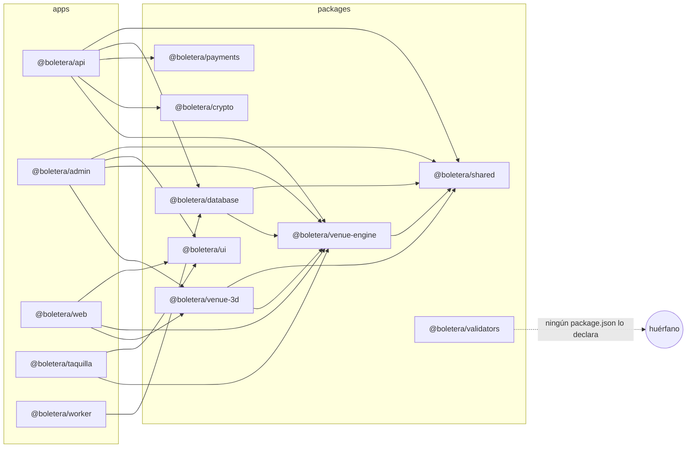
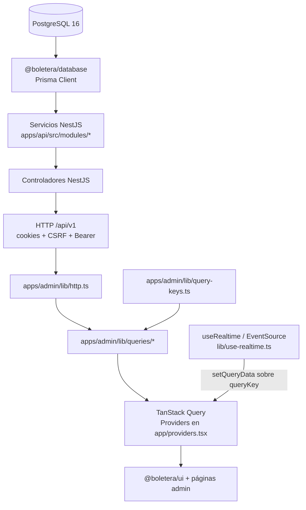
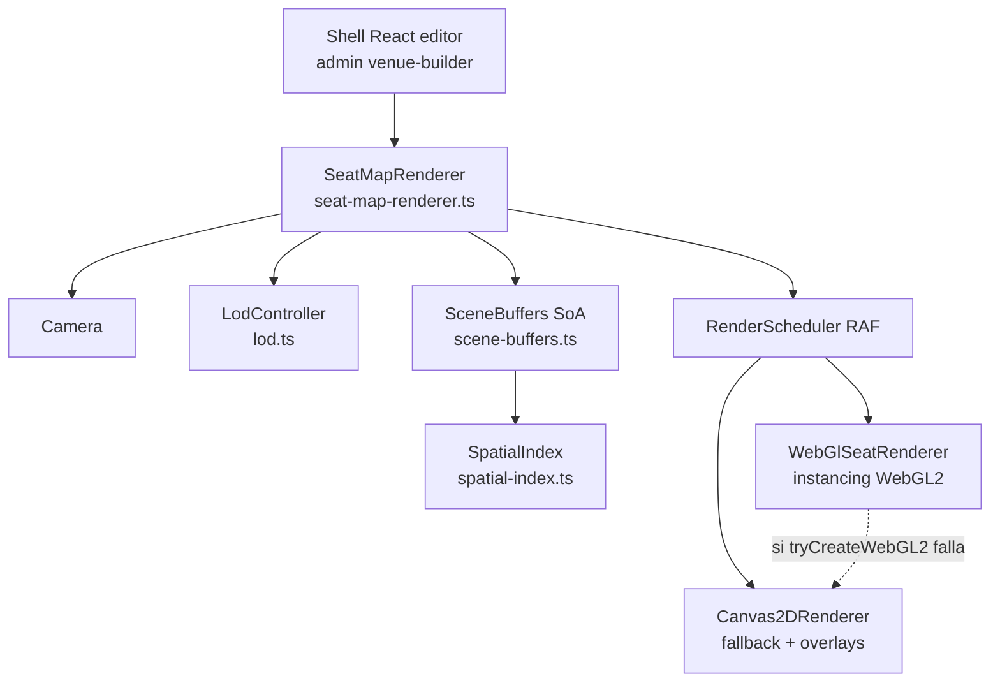
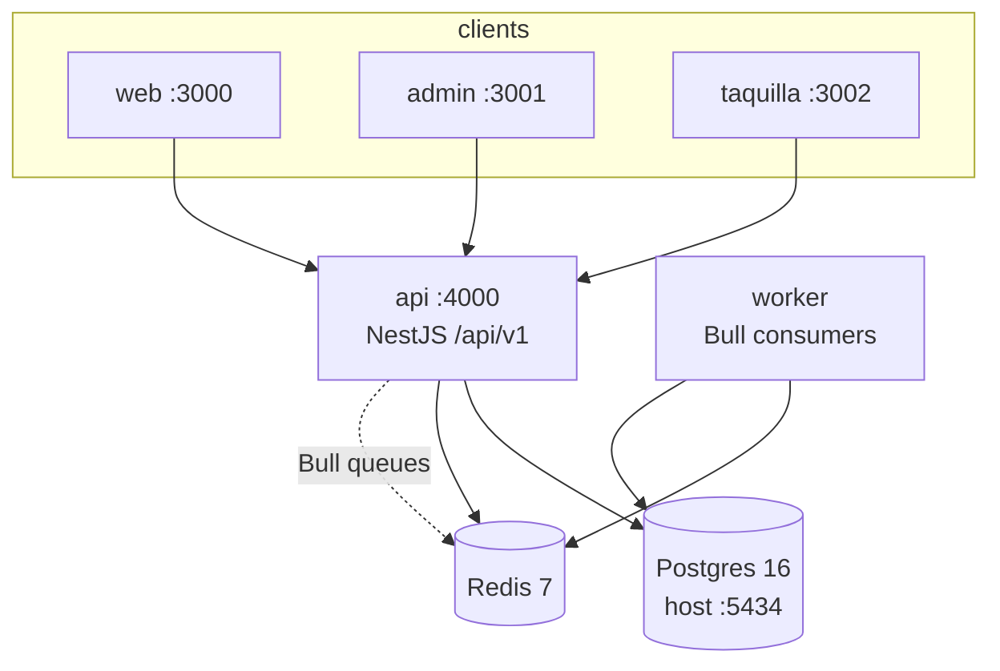

# Arquitectura — Boletera Platform

Documento canónico del monorepo. Todo lo aquí descrito está verificado contra el código en la fecha de redacción. Si algo está a medias, se marca **parcial** o **no implementado**.

**Producto:** Boletera Platform (`package.json` raíz: `boletera-platform`, scope npm `@boletera/*`).  
**Mercado por defecto:** México · MXN · `es-MX` · `America/Mexico_City` (`packages/shared/src/locale.ts`, `packages/shared/src/money.ts`).  
**Inconsistencia de naming:** el string `TicketOS` aparece solo en `apps/admin/components/operating-modules/OperatingModulePage.tsx` (breadcrumb); el resto del repo usa Boletera.

## Enlaces cruzados

| Recurso | Ruta |
|---------|------|
| README del monorepo | [`../README.md`](../README.md) |
| ADRs | [`./adr/`](./adr/) |
| Guías de desarrollo | [`./guias/`](./guias/) |
| Ciclo de vida de dominio | [`./dominio/ciclo-de-vida.md`](./dominio/ciclo-de-vida.md) |
| Glosario | [`./dominio/glosario.md`](./dominio/glosario.md) |
| API docs | [`./api/README.md`](./api/README.md) |
| Métricas | [`./api/metricas.md`](./api/metricas.md) |
| Contrato de seguridad (cookies, tenant, roles) | [`../apps/api/src/modules/auth/SECURITY-MIGRATION.md`](../apps/api/src/modules/auth/SECURITY-MIGRATION.md) |
| Este documento reemplaza | [`./ARCHITECTURE.md`](./ARCHITECTURE.md) (obsoleto) |

## Stack del monorepo

| Pieza | Versión / detalle verificado |
|-------|------------------------------|
| pnpm | `10.30.3` (`packageManager` en `package.json`) |
| Turborepo | `^2.9.14` (`turbo.json`) |
| Node | `>=22.0.0` |
| Workspaces | `apps/*`, `packages/*` (`pnpm-workspace.yaml`) |
| Prisma | 6 + PostgreSQL 16 (`packages/database`) |
| NestJS API | prefijo global `api/v1`, Swagger `/api/docs`, puerto `4000` |

### Comandos raíz verificados (`package.json`)

```bash
pnpm dev                 # turbo run dev --parallel
pnpm dev:api|web|admin|taquilla|worker
pnpm build | check-types | lint | test
pnpm db:generate | db:migrate:dev | db:migrate:deploy | db:seed | db:studio | db:reset
pnpm docker:up | docker:down | docker:build | docker:logs | docker:reset
pnpm ci:verify           # turbo run check-types lint test build
pnpm smoke:api | smoke:venue-engine
pnpm test:e2e            # playwright -c e2e/playwright.config.ts
```

---

## 1. Mapa del monorepo

```
BOLETERA-app/
├── apps/
│   ├── api/        NestJS 11 — backend HTTP + colas Bull
│   ├── web/        Next.js 16 — marketplace comprador (:3000)
│   ├── admin/      Next.js 16 — panel promotor/ops (:3001)
│   ├── taquilla/   Next.js 16 — POS taquilla (:3002)
│   └── worker/     Node/tsx — jobs Bull (holds, SPEI, payouts, schedule)
├── packages/
│   ├── shared/         Tipos, enums, money, locale, scheduling, analytics-contracts
│   ├── ui/             Design system React (admin/web/taquilla)
│   ├── database/       Schema Prisma + client generado
│   ├── venue-engine/   Mapas 2D + motor de render WebGL2/Canvas2D
│   ├── venue-3d/       Viewer React Three Fiber
│   ├── payments/       Providers Banorte + Cash (registry)
│   ├── crypto/         QR firmado HMAC de boletos
│   └── validators/     Schemas Zod — **sin consumidores workspace hoy**
├── docs/               Este documento + ADRs/guías (otros agentes)
├── docker-compose.yml
├── turbo.json
└── .env.example
```

### Grafo de dependencias `workspace:*`



Fuente: `dependencies` con `workspace:*` en cada `package.json` de `apps/` y `packages/`.

---

## 2. Responsabilidad de cada app

| App | Puerto | Framework | Quién la usa | Cómo habla con la API |
|-----|--------|-----------|--------------|------------------------|
| `apps/api` (`@boletera/api`) | **4000** | NestJS 11 | Todas las apps cliente | Es el servidor. Prefijo `api/v1`. Swagger en `/api/docs` (`apps/api/src/main.ts`). |
| `apps/web` (`@boletera/web`) | **3000** | Next.js 16 + React 19 | Comprador final | `NEXT_PUBLIC_API_URL` → `fetch` / Axios vía `apps/web/lib/api.ts` y constantes locales `API`. Usa `react-query` **v3** (legacy respecto a admin). |
| `apps/admin` (`@boletera/admin`) | **3001** | Next.js 16 + React 19 + TanStack Query v5 | Promotor / ops / admin | `NEXT_PUBLIC_ADMIN_API_URL` (fallback a `:4000/api/v1`) vía `apps/admin/lib/http.ts` (cookies + CSRF + Bearer de migración). |
| `apps/taquilla` (`@boletera/taquilla`) | **3002** | Next.js 16 + React 19 | Cajero POS | `NEXT_PUBLIC_API_URL` vía `apps/taquilla/lib/auth.ts` y componentes POS. Requiere rol `TAQUILLA`+. |
| `apps/worker` (`@boletera/worker`) | health propio (config) | Node + tsx + Bull | Ops / backend | No es HTTP de producto: consume colas Redis. Jobs: `release-expired-holds`, `process-pending-payouts`, `reconcile-banorte-spei`, `schedule-tick` (`apps/worker/src/index.ts`). Habla Postgres vía `@boletera/database`. |

### API — módulos NestJS registrados

`apps/api/src/app.module.ts` importa **32** módulos de dominio/infra (excluyendo `ConfigModule` / `ThrottlerModule` / `BullModule.forRoot`):

`CommonModule`, `TenantModule`, `PrismaModule`, `AuthModule`, `DiscoveryModule`, `InventoryModule`, `PricingModule`, `OrdersModule`, `PaymentModule`, `ResaleModule`, `FraudModule`, `AnalyticsModule`, `AdminModule`, `NotificationModule`, `AccessModule`, `SeatMapping3DModule`, `EventManagementModule`, `EventSchedulingModule`, `ChannelManagementModule`, `TaquillaPosModule`, `LayoutManagementModule`, `SearchModule`, `ReportingModule`, `CampaignExecutionModule`, `VenueLayoutModule`, `OrganizationModule`, `WaitlistModule`, `TicketTransferModule`, `PartnersModule`, `BillingModule`, `SeasonModule`, `MetricsModule`.

Directorios físicos en `apps/api/src/modules/` (mismo conjunto; carpetas `search-service` y `reporting-service` exportan `SearchModule` / `ReportingModule`).

---

## 3. Responsabilidad de cada package

| Package | Exporta (entrada) | Consumidores |
|---------|-------------------|--------------|
| `@boletera/shared` | `packages/shared/src/index.ts`: `constants`, `types`, `enums`, `scheduling`, `money`, `locale`, `analytics-contracts` | api, admin, database, venue-engine, venue-3d |
| `@boletera/ui` | `packages/ui/src/index.ts`: tokens, hooks, primitivas (Button, Input, Modal…), charts (Line/Area/Bar/Donut/Heatmap/Funnel), DataTable, PageHeader, etc. **Sin** `export *` | admin, web, taquilla |
| `@boletera/database` | `packages/database/src/index.ts`: `prisma` + reexport del client generado (`generated/client`) | api, worker |
| `@boletera/venue-engine` | `src/index.ts`: map-utils, seatmap-canvas, layout-templates, geometry. Entrada separada `@boletera/venue-engine/render` (DOM/WebGL) | api, admin, web, taquilla, database, venue-3d |
| `@boletera/venue-3d` | `Venue3DViewer`, `SeatViewCamera`, helpers `bowlLayout` | admin, web |
| `@boletera/payments` | types, `registry` (`initDefaultProviders` → Banorte + Cash), Banorte Payworks, cash provider | api |
| `@boletera/crypto` | `generateTicketCode`, `signTicketPayload`, `verifyTicketSignature`, `buildQrPayload` (HMAC, ventana 15s) | api |
| `@boletera/validators` | Zod: auth, inventory, orders, venue (`src/index.ts`) | **ninguno** — ningún otro `package.json` declara la dependencia |

**Nota:** `packages/shared/src/ai-contracts.ts` existe (contratos AI de forecast/anomalías/fraude) pero **no** se reexporta desde `index.ts` → superficie **parcial** / no cableada al barrel público.

---

## 4. Flujo de datos de punta a punta (admin)

Cadena verificada para el panel admin:



### Piezas del cliente admin

| Archivo | Rol |
|---------|-----|
| `apps/admin/lib/http.ts` | `fetch` a `NEXT_PUBLIC_ADMIN_API_URL`, `credentials: 'include'`, CSRF en mutaciones, refresh deduplicado `POST /auth/refresh`, tipado de errores (`HttpError`, `AuthenticationError`, …). |
| `apps/admin/lib/query-keys.ts` | Factory de keys jerárquicas (`events`, `orders`, `metrics`, `analytics`, `venues`, …). |
| `apps/admin/lib/queries/*` | Hooks de dominio: p.ej. `useOrders` → `GET /admin/orders`; `useEventHub` → `GET /events/manage/:id/hub`; `usePlatformOverview` → `GET /admin/platform/overview`. Barrel en `queries/index.ts`. |
| `apps/admin/app/providers.tsx` | `QueryClient` (staleTime 2 min default; overrides por dominio), `SessionProvider`, `ErrorBoundary`. |
| `apps/admin/lib/prefetch.ts` | Prefetch al hover/focus de nav (`/dashboard`, `/events`, `/orders`, `/maps`, settings org). |
| `apps/admin/lib/use-realtime.ts` | SSE → `queryClient.setQueryData`; dashboard en `/reports/dashboard/realtime/:orgId/stream`. |

Contrato de cookies/CSRF/refresh: ver [`SECURITY-MIGRATION.md`](../apps/api/src/modules/auth/SECURITY-MIGRATION.md) — **no duplicar aquí**.

---

## 5. Límites entre dominios (Prisma ↔ módulos API)

### Inventario de schema

`packages/database/prisma/schema.prisma`:

- **46 modelos** (`^model `)
- **33 enums** (`^enum `)

Modelos: `Organization`, `Venue`, `VenueLayout`, `Section`, `SeatRow`, `Seat`, `EventSeatMap`, `SeatHold`, `TenantTheme`, `AccessZone`, `TicketScan`, `PaymentIntent`, `AuditEvent`, `CashierShift`, `Event`, `EventSeries`, `SalePhase`, `VenueBlackout`, `Offer`, `Ticket`, `Order`, `OrderItem`, `Payment`, `Refund`, `User`, `Session`, `PosTerminal`, `PosCashierSession`, `ResaleListing`, `ResaleOffer`, `DynamicPrice`, `Promotion`, `FraudFlag`, `EventAnalytics`, `PromoterPayout`, `Cart`, `Wishlist`, `Review`, `WaitlistEntry`, `TicketTransfer`, `ApiKey`, `FiscalProfile`, `CfdiInvoice`, `SeasonPass`, `SeasonPassEvent`, `SeasonPassPurchase`.

### Dueño primario (por convención observada en `*.service.ts`)

| Módulo API | Modelos de los que es dueño / escribe | Cruza fronteras |
|------------|----------------------------------------|-----------------|
| `auth` | `User`, `Session` | — |
| `tenant` | Lectura `Organization` + `TenantTheme` (proyección pública) | Solo branding storefront |
| `organization` | `Organization`, miembros `User` | — |
| `discovery` / `search-service` | Lectura `Event` (+ señales de `Order`) | Lectura cruzada de órdenes |
| `event-management` | `Event` | — |
| `event-scheduling` | `EventSeries`, `SalePhase`, `VenueBlackout`, instancias `Event` | — |
| `inventory` | `Ticket`, `SeatHold`, `Offer` (disponibilidad) | — |
| `pricing` | `DynamicPrice`, precios sobre `Offer`/`Promotion` | — |
| `orders` | `Order`, `OrderItem`, `PaymentIntent`, holds, tickets al emitir | Crea/lee `User`, `Promotion`, `Event`, `Offer` |
| `payment` | `Payment`, reconciliación Banorte | Órdenes |
| `resale` | `ResaleListing`, `ResaleOffer` | `Ticket`, `Order`, `Event` |
| `fraud` | `FraudFlag` | Lee `Order`, `User`, `AuditEvent` |
| `analytics` / `metrics` / `reporting-service` | Agregados / `EventAnalytics` | Lectura amplia multi-modelo (**cross-cutting**) |
| `admin` | Facade ops | **Cruza mucho:** `Order`, `Event`, `Venue`, `Ticket`, `FraudFlag`, `User`, `TenantTheme`, `PosTerminal`, `Refund` |
| `access` | `TicketScan`, `AccessZone`, estado de `Ticket` | Lee `TicketTransfer`, escribe `AuditEvent` |
| `venue-layout` | `VenueLayout`, sync asientos, publish a `Ticket`/`EventSeatMap` | `Venue`, `Event`, `Ticket` |
| `layout-management` | Orquesta creación de layouts | Delega en `venue-layout` + `inventory` (**solapa** con venue-layout) |
| `seat-mapping-3d` | Proyección 3D desde `VenueLayout` / tickets | Lectura `Venue`, `Event`, `Ticket` |
| `taquilla-pos` | `PosTerminal`, `PosCashierSession`, `CashierShift`, checkout | Órdenes/pagos |
| `channel-management` | Cuotas de canal en metadata/`Event` | — |
| `campaign-execution` | `Promotion` + metadata de campañas en `Event` | — |
| `waitlist` | `WaitlistEntry` | `Event` |
| `ticket-transfer` | `TicketTransfer` | `Ticket` |
| `partners` | `ApiKey` | — |
| `billing` | `FiscalProfile`, `CfdiInvoice` | Lee `Order` |
| `season` | `SeasonPass`, `SeasonPassEvent`, `SeasonPassPurchase` | — |
| `notification` | Sin modelo propio (mail/PDF) | Lee órdenes/tickets |
| `prisma` | Acceso DB compartido | Infra |

### Modelos sin servicio API dedicado

`Cart`, `Wishlist`, `Review`: existen en schema y seed (`packages/database/scripts/seed.ts`), pero **no** hay `prisma.cart|wishlist|review` en `apps/api/src` → **parcial / schema-only**.

---

## 6. Modelo multi-tenant

**Unidad de tenancy:** `Organization` (`schema.prisma`).

### Runtime request-scoped

1. **`TenantContextService`** (`apps/api/src/common/tenant-context.service.ts`)  
   - `AsyncLocalStorage<TenantContext>` con `{ organizationId?, userId?, privileged }`.  
   - `requireOrganization()`: exige org y **falla** si `privileged` (SUPER_ADMIN no “hereda” tenant implícito).  
   - `assertOrganization(id)`: niega si no privilegiado y el id no coincide.

2. **`TenantContextInterceptor`** (`apps/api/src/common/tenant-context.interceptor.ts`)  
   - Registrado como `APP_INTERCEPTOR` desde `AuthModule`.  
   - `privileged = user.role === 'SUPER_ADMIN'`.  
   - Rechaza `organizationId`/`orgId` en params/query/body distintos al JWT.  
   - Envuelve el handler en `tenantContext.run(...)`.

3. **`TenantScopeService`** (`apps/api/src/modules/tenant/tenant-scope.service.ts`)  
   - Resuelve org efectiva para SUPER_ADMIN (debe nombrar tenant) vs tenant-bound.  
   - `assertAnonymousOrOwn` para endpoints públicos.

4. **`TenantModule`**  
   - `GET /api/v1/tenant/current` resuelve branding por `Host` → subdomain / `TenantTheme` / slug (`tenant.service.ts`). En loopback usa slug `boletera-plataforma` (o `DEMO_TENANT_SLUG`) y discovery agrega los orgs del seed marketplace.

5. **Guards**  
   - `OrgAccessGuard`: misma regla de org en ruta vs JWT (`org-access.guard.ts`).  
   - `RolesGuard`: jerarquía de roles + permisos intersection-based (`roles.guard.ts`).

### Riesgo real de aislamiento

**No hay** PostgreSQL Row-Level Security ni extensión de Prisma Client que inyecte `organizationId`.

El aislamiento depende de que **cada servicio** filtre a mano con `organizationId` / `requireOrganization()` / lookups compuestos `{ id, organizationId }`. Lo documenta explícitamente [`SECURITY-MIGRATION.md`](../apps/api/src/modules/auth/SECURITY-MIGRATION.md) (“Tenant-scoped module adoption”): el interceptor es un boundary check, **no** sustituye queries scoped. Un olvido en un `findUnique({ where: { id } })` es fuga cross-tenant.

`TenantContextService` se provee/exporta desde `AuthModule`; la adopción en servicios es **parcial** (varios módulos ya lo inyectan; no todos los servicios tenant-owned lo usan de forma uniforme).

---

## 7. Capa de renderizado de mapas (`venue-engine/render`)

Entrada: `@boletera/venue-engine/render` → `packages/venue-engine/src/render/index.ts`.

Arquitectura (vista de sistema; el detalle de uso lo cubre otra doc):



| Pieza | Archivo | Qué hace |
|-------|---------|----------|
| Orquestador | `seat-map-renderer.ts` | `mount` / `setScene` / `destroy`; elige backend WebGL2 o Canvas2D; overlay 2D para vectores cuando hay GPU. |
| GPU | `webgl-renderer.ts` | WebGL2, un draw-call con **instancing** (pos/color/scale), shaders GLSL 300 es. |
| Fallback | `canvas2d-renderer.ts` | Raster + overlays de análisis/interacción. |
| Espacial | `spatial-index.ts` | Hash espacial uniforme (no quadtree) sobre SoA `Float32Array`; pensado para 100k–250k asientos. |
| LOD | `lod.ts` | Niveles `seats` → `rows` → `sections` con histéresis según `seatRadius * zoom`. |
| Cámara | `camera.ts` | Pan/zoom, reduced-motion. |

El entry Node-safe (`@boletera/venue-engine`) **no** importa `render/` para no arrastrar DOM a la API.

---

## 8. Runtime e infraestructura

### Docker Compose (`docker-compose.yml`)

| Servicio | Imagen | Puertos host | Notas |
|----------|--------|--------------|-------|
| `postgres` | `postgres:16-alpine` | **5434→5432** | Comentario: 5432/5433 suelen ocupados en Windows. DB `boletera`. |
| `redis` | `redis:7-alpine` | **6379** | |
| `api` | `Dockerfile.api` | 4000 | `DATABASE_URL=...@postgres:5432/...`, `REDIS_URL=redis://redis:6379` |
| `web` | `Dockerfile.web` APP_NAME=web | 3000 | |
| `admin` | `Dockerfile.web` APP_NAME=admin | 3001→3000 | |

Red: `boletera-network` (bridge). **Inconsistencia:** `api`/`web`/`admin` declaran `networks: [boletera-network]`; `postgres` y `redis` **no**. En Compose v3, servicios sin `networks` quedan en la red default del proyecto, distinta de `boletera-network` → el DNS interno `postgres`/`redis` desde el contenedor `api` **probablemente falla**. Ver §9.

No hay servicio `taquilla` ni `worker` en este compose.

### Bootstrap API (`apps/api/src/main.ts`)

- Valida `DATABASE_URL` + `JWT_SECRET` (y `CORS_ORIGIN` en production).
- `helmet` (CORP cross-origin para frontends).
- Prefijo `api/v1`; Swagger en `api/docs`.
- `ValidationPipe`: `whitelist: true`, `forbidNonWhitelisted: true`, `transform: true`.
- Cookies parseadas (`cookie.middleware.ts`); CORS con credentials.

### App module

- `ThrottlerModule.forRoot([{ ttl: 60_000, limit: 120 }])` + `ThrottlerGuard` global → **120 req / 60 s**.
- `BullModule.forRoot({ redis: process.env.REDIS_URL || 'redis://localhost:6379' })`.

### Turbo (`turbo.json`)

Tasks: `dev` (persistent, no cache), `build` (dependsOn `^build`), `check-types`, `lint`, `test`, `test:e2e`.  
`globalEnv` incluye `DATABASE_URL`, `REDIS_URL`, `NEXT_PUBLIC_API_URL`, `NEXT_PUBLIC_ADMIN_API_URL`, etc.

### `.env.example` (fragmento relevante)

- `DATABASE_URL` apunta a **`localhost:5432`** (no coincide con compose host **5434**).
- `REDIS_URL=redis://localhost:6379`
- `API_PORT=4000`, Banorte, JWT, OAuth admin, SMTP, AWS S3 placeholders.
- `API_INTERNAL_URL` aparece **dos veces** (líneas 52 y 73).
- `RATE_LIMIT_WINDOW_MS` / `RATE_LIMIT_MAX_REQUESTS` están declarados pero **no** se leen en `apps/api/src` (el throttle real es el de Nest Throttler).

---

## 9. Inconsistencias y deuda detectada

| # | Hallazgo | Evidencia |
|---|----------|-----------|
| 1 | Compose: `postgres`/`redis` fuera de `boletera-network` | `docker-compose.yml`: solo `api`/`web`/`admin` listan la red |
| 2 | Puerto DB: example 5432 vs compose host 5434 | `.env.example` vs `docker-compose.yml` ports; README ya documenta 5434 |
| 3 | `API_INTERNAL_URL` duplicada | `.env.example` L52 y L73 |
| 4 | Artefactos compilados versionados en `src/` | `packages/shared/src/*.{js,d.ts}`, `packages/database/src/*.{js,d.ts}` (y otros packages con `.js` en `src/`) |
| 5 | Analytics admin: helpers duplicados en migración | `format.ts`/`range.ts` (usados por `page.tsx`) **y** `_lib/format.ts`/`_lib/range.ts` (usados por `_components/*`). También `AlertsPanel.tsx` raíz **y** `_components/AlertsPanel.tsx` |
| 6 | Naming `TicketOS` vs Boletera | Solo `OperatingModulePage.tsx` |
| 7 | `@boletera/validators` huérfano | Ningún workspace lo declara en `dependencies` |
| 8 | `@nestjs/typeorm` en `apps/api/package.json` sin uso | Cero `TypeOrmModule` / imports en `apps/api/src` |
| 9 | Enums de pago globales vs providers reales | `PaymentGateway` incluye STRIPE/ADYEN/…; `packages/payments` solo registra Banorte + Cash; comentario explícito “sin Stripe” |
| 10 | `Currency` Prisma (15 valores) vs money shared (`MXN` \| `USD`) | `schema.prisma` enum `Currency` vs `packages/shared/src/money.ts` |
| 11 | Campo legacy `Organization.stripeAccountId` | Comentario en schema: “Legacy unused — Banorte is the active gateway” |
| 12 | Fraud “ML” aspiracional vs heurísticas | `fraud.service.ts`: score por reglas (velocity, duplicate…); KYC/AML son stubs que siempre `cleared` |
| 13 | `ai-contracts.ts` no exportado del barrel shared | Existe el archivo; `index.ts` no lo reexporta |
| 14 | Modelos `Cart`/`Wishlist`/`Review` sin API | Solo seed; sin servicios Nest |
| 15 | Solape `layout-management` ↔ `venue-layout` | LayoutManagementService delega en VenueLayoutService / LayoutAccessService |
| 16 | Vars `RATE_LIMIT_*` en env sin efecto | Throttler hardcodeado 120/60s en `app.module.ts` |
| 17 | React Query divergente | web: `react-query@3`; admin: `@tanstack/react-query@5` |
| 18 | Docs hermanas aún no presentes en disco | Al redactar: `docs/adr/`, `docs/guias/`, `docs/dominio/`, `docs/api/` no existían (enlaces reservados) |
| 19 | `AdminModule` como fachada multi-dominio | Un solo service toca órdenes, eventos, venues, fraude, branding, POS counts |
| 20 | Aislamiento tenant solo por disciplina de código | Sin RLS / sin Prisma extension — riesgo de fuga (ver §6) |

---

## 10. Qué NO existe (aunque docs viejas o enums lo sugieran)

Verificado por ausencia o stub explícito:

| Afirmación aspiracional | Realidad en código |
|-------------------------|-------------------|
| Stripe como pasarela activa | **No.** Registry Banorte+Cash; Stripe solo enum/legacy/`PaymentProviderId` type |
| ML fraud scoring | **No.** Reglas heurísticas + KYC/AML stub |
| Kubernetes / CloudFlare / ALB en este repo | **No** como despliegue implementado; runbooks mencionan K8s como camino futuro (P-01) |
| Multi-moneda operativa 15+ | Enum Prisma ancho; runtime de money = MXN (USD tipado en shared, no “15 monedas vivas”) |
| Adyen / Square / Razorpay / Worldpay providers | Solo valores de enum |
| Cart / Wishlist / Review API | Modelos + seed; **sin** módulos |
| `@boletera/validators` en el grafo de build de apps | Package presente, **no consumido** |
| TypeORM | Dependencia muerta |
| RLS PostgreSQL | **No implementado** |

---

## Diagrama resumen del sistema



---

*Documento canónico. Ante conflicto con `ARCHITECTURE.md`, gana este archivo.*
