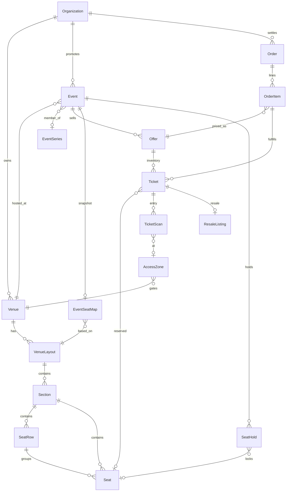
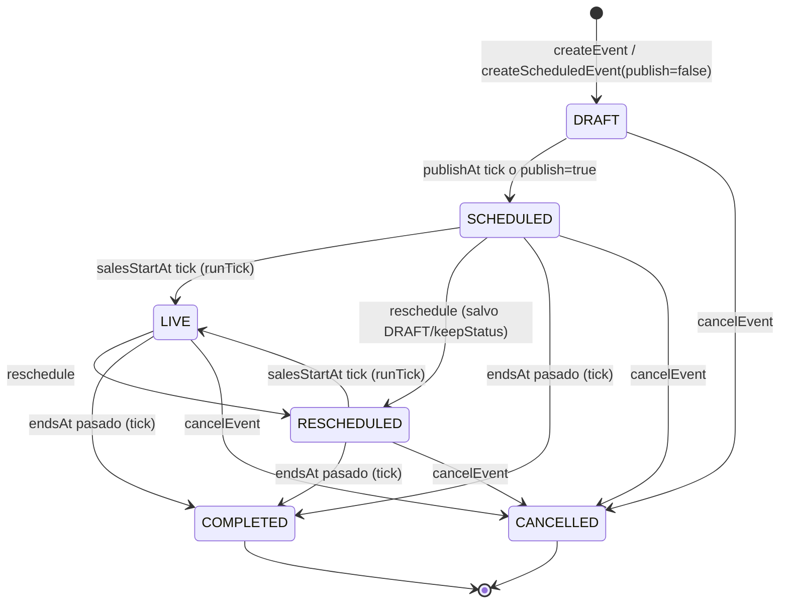
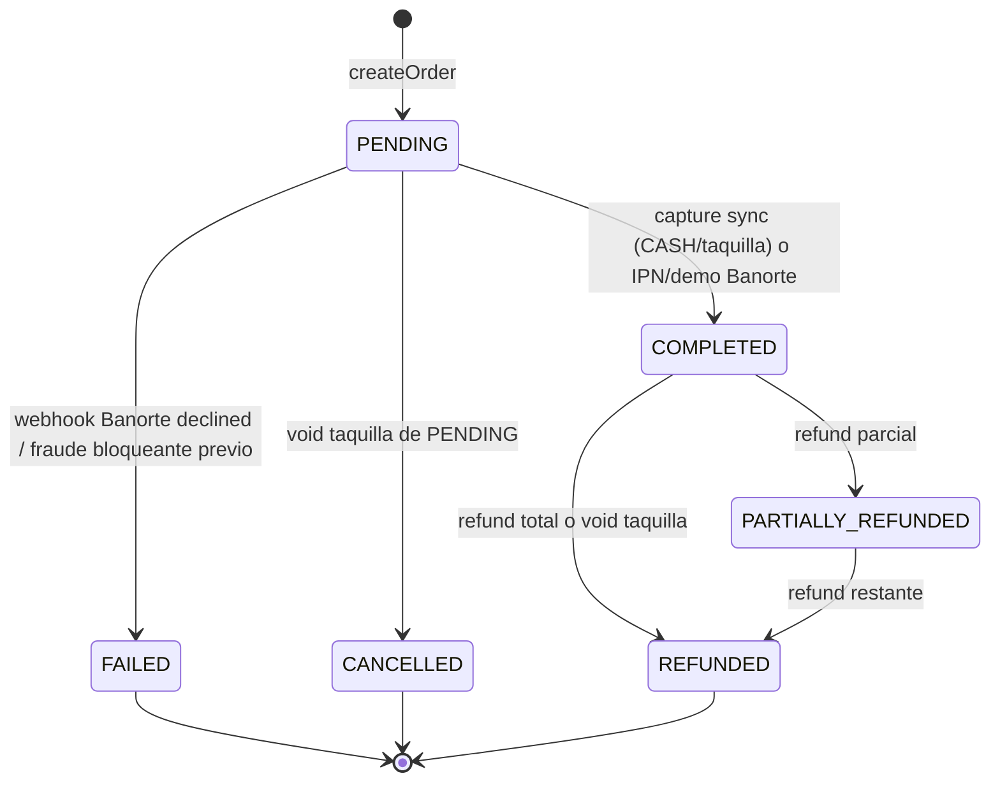

# Ciclo de vida del dominio de ticketing

## Modelo mental en 10 líneas

1. Una **Organization** (promotor/recinto/plataforma) es el inquilino (`tenant`) dueño de venues, eventos, órdenes y liquidaciones.
2. Un **Venue** tiene geometría (`VenueLayout → Section → SeatRow → Seat`) y zonas de acceso (`AccessZone`).
3. Un **Event** es una fecha vendible; puede pertenecer a una **EventSeries** (tour, residencia, temporada, festival).
4. Lo que se vende no es el asiento crudo: se vende una **Offer** (zona/nivel de precio con inventario).
5. Cada unidad inventariable es un **Ticket** (con o sin `seatId`); el checkout primero crea un **SeatHold** temporal.
6. Una **Order** agrupa holds; el pago (Banorte CARD/SPEI/OXXO o efectivo en taquilla) confirma la orden y marca boletos `SOLD`.
7. El comprador entra al recinto con un **QR firmado y rotativo**; el escaneo exitoso pasa el boleto a `USED`.
8. Después de comprar, el boleto puede **transferirse** (misma unidad, cambia titular) o **revenderse** (marketplace con comisión y topes).
9. Hay canales paralelos: **WEB**, **TAQUILLA** (POS), **API** y **ADMIN**; mismos holds/órdenes, TTL y captura distintos.
10. Dinero y cumplimiento: precios/comisiones en Decimal mayor (pesos) en DB, aritmética ideal en **centavos**; CFDI en sandbox; payouts aún manuales.

---

## 1. Ciclo de vida de un EVENTO

### Estados reales (`EventStatus`)

Valores en Prisma: `DRAFT`, `SCHEDULED`, `LIVE`, `COMPLETED`, `CANCELLED`, `RESCHEDULED`.

| Estado | Significado operativo |
|---|---|
| `DRAFT` | Borrador; no aparece como vendible salvo override `ADMIN`. |
| `SCHEDULED` | Publicado/programado; puede tener ventanas de venta futuras. |
| `LIVE` | En venta activa según el tick del scheduler (ver abajo). |
| `RESCHEDULED` | Fecha movida; conserva historial en `rescheduledFrom` / `scheduleNote`. |
| `COMPLETED` | Show terminado (`endsAt` pasado, o `startsAt` + 12 h si no hay `endsAt`). |
| `CANCELLED` | Cancelado; ofertas y fases se cierran. |

> Importante: el estado comercial “anunciado / preventa / en venta / cerrado” **no** es `EventStatus`. Se calcula con `resolveSaleStatus()` en `packages/shared/src/scheduling.ts` (`SaleState`: `DRAFT`, `ANNOUNCED`, `PRESALE`, `ON_SALE`, `PAUSED`, `CLOSED`, `CANCELLED`, `PAST`). `PAUSED` existe en el tipo compartido, pero hoy no hay transición que lo asigne en el resolver.

### Quién dispara cada transición

| Transición | Quién / dónde |
|---|---|
| Crear `DRAFT` | Admin/promotor vía `EventManagementService.createEvent` o `EventSchedulingService.createScheduledEvent/createSeries` con `publish=false`. |
| `DRAFT → SCHEDULED` | Manual al crear con `publish=true`, o automático en `EventSchedulingService.runTick` cuando `publishAt <= now`. El worker llama `POST /events/schedule/tick` cada `WORKER_INTERVAL_MS` (default **30 s**, `apps/worker/src/config.ts`). |
| `SCHEDULED/RESCHEDULED → LIVE` | `runTick` cuando `salesStartAt <= now` y la ventana no ha cerrado; además marca `Offer.isAvailable = true`. |
| Cierre de venta (sin cambiar status) | `runTick` cuando `salesEndAt <= now` pone `Offer.isAvailable = false` (el evento puede seguir `LIVE`/`SCHEDULED` hasta completarse). |
| `* → RESCHEDULED` | `EventSchedulingService.reschedule` (requiere `reason`). Si `keepStatus` o el evento era `DRAFT`, no cambia status. |
| `* → CANCELLED` | `EventSchedulingService.cancelEvent`: setea `cancelledAt`, `Offer.isAvailable=false`, fases `SCHEDULED/ACTIVE → CANCELLED`. |
| `* → COMPLETED` | `runTick` cuando `endsAt < now`, o si no hay `endsAt` y `startsAt` lleva más de **12 horas**. |
| Serie → `COMPLETED` | `runTick` cuando todos sus eventos están `COMPLETED` o `CANCELLED`. |

### Relación Event → Offer → Ticket

- **Event**: la fecha/show.
- **Offer**: SKU comercial por zona (`unique [eventId, zone]`). Tiene `basePrice`, `fees`, cantidades `total/remaining/sold/hold`, límites `minPerOrder`/`maxPerOrder` (default 1–10).
- **Ticket**: unidad inventariable. En reserved seating tiene `seatId` y `@@unique([eventId, seatId])`. En GA, `seatId` es `null` (PostgreSQL permite muchos `NULL` en ese unique).

El mapa publicado del evento es un snapshot: `EventSeatMap` apunta a un `VenueLayout` y guarda `snapshotData` JSON. Publicar layout para un evento vive en `apps/api/src/modules/venue-layout/event-publish.service.ts`.

### Series (`EventSeries`)

Enums:
- `EventSeriesKind`: `SERIES`, `RESIDENCY`, `TOUR`, `SEASON`, `FESTIVAL`
- `EventSeriesStatus`: `DRAFT`, `ACTIVE`, `COMPLETED`, `ARCHIVED`

Creación real en `EventSchedulingService.createSeries`:
- Expande `RecurrenceRule` con `expandRecurrence` (`MAX_OCCURRENCES = 366`, default count 12).
- Detecta conflictos de recinto: solape, turnaround default **90 min**, blackouts.
- Crea N `Event` + oferta base opcional (`template.zoneName`) + `SalePhase` derivadas de offsets en días antes del show.
- `publish=true` → serie `ACTIVE` y eventos `SCHEDULED`; si no, serie/eventos `DRAFT`.

Hay un camino legacy en `EventManagementService.createEventSeries/createResidency` que crea eventos `SCHEDULED` **sin** modelo `EventSeries` (solo metadata JSON). Convivencia a medias.

### Fases de venta (`SalePhase`)

- `SalePhaseKind`: `PRESALE`, `MEMBERS`, `PUBLIC`, `LAST_MINUTE`, `DOOR`
- `SalePhaseStatus`: `SCHEDULED`, `ACTIVE`, `ENDED`, `CANCELLED`

Reglas verificadas:
- Una fase con `code` **no** abre venta general; aparece en `gatedPhases` y se desbloquea con el código (`SaleWindowService.assertPurchasable`).
- Canal vacío = todos los canales; si hay lista, debe incluir el canal del hold/orden.
- `discountPercent` de plantilla de serie: 0–90.
- Prioridad default 100 (menor corre primero al solaparse).
- El canal `ADMIN` bypasea la ventana de venta.

### Bloqueos de recinto (`VenueBlackout`)

- Soft (`blocking=false`) vs hard (`blocking=true`, default).
- Los hard bloquean scheduling salvo `force=true`.
- Turnaround entre shows: `DEFAULT_TURNAROUND_MINUTES = 90` en `packages/shared/src/scheduling.ts`.
- Duración default de show: `DEFAULT_EVENT_DURATION_MINUTES = 180`.

### Defaults de evento relevantes

En schema `Event`:
- `holdExpiration` default **900** segundos (campo del modelo; el TTL efectivo de holds lo fija el servicio de inventario, ver §4).
- `surgeThreshold` default **0.8**, `surgePriceMultiplier` default **1.25**.
- `commission` no vive en el evento: vive en `Organization.commissionRate` (default **0.15**).
- `allowResale` default true, `transferAllowed` default true, `refundable` default true.

---

## 2. Ciclo de vida de una ORDEN

### Enums

- `OrderStatus`: `PENDING`, `COMPLETED`, `FAILED`, `REFUNDED`, `CANCELLED`, `PARTIALLY_REFUNDED`
- `PaymentStatus`: `PENDING`, `COMPLETED`, `FAILED`, `REFUNDED`, `CANCELLED`, `DISPUTE`
- `PaymentMethod`: `CARD`, `BANK_TRANSFER`, `PAYPAL`, `APPLE_PAY`, `GOOGLE_PAY`, `CRYPTO`, `LOCAL_PAYMENT`, `CASH`, `OXXO`, `SPEI`, `CLIP`
- `PaymentGateway`: incluye `BANORTE` (activo), `CASH`, `OXXO`, `SPEI`, `CLIP`, y legados (`STRIPE` marcado “do not use for new payments”, etc.)
- `SalesChannel`: `WEB`, `TAQUILLA`, `API`, `ADMIN`

### Flujo de checkout (WEB)

1. **Selección**: mapa/offer → el cliente pide hold (`InventoryService.createHold` o `createBestAvailableHold`).
2. **Hold**: asientos/GA pasan a `TicketStatus.HELD` + fila `SeatHold` `ACTIVE` + lock Redis `hold:{eventId}:{seatId}` (si hay asiento).
3. **Orden**: `OrdersService.createOrder` exige holds `ACTIVE` y no expirados.
4. **Pricing**: `PricingService.calculatePrice` (dinámico + promo + fee 10% + IVA 16%).
5. **Fraude**: `FraudService.analyzeFraud`; si `BLOCK`, no se crea la orden.
6. **Pago**:
   - **Sync** (taquilla / CASH / captura inmediata): crea `Payment` `COMPLETED`, orden `COMPLETED`, holds `CONVERTED`, tickets `SOLD` + nuevo `code`.
   - **Async Banorte WEB** (`requiresAsyncCapture`): deja orden `PENDING`, crea `PaymentIntent` con `holdIds` en metadata, devuelve `paymentAction` (`redirectUrl` / SPEI / OXXO).
7. **Confirmación**:
   - Demo: `PaymentService.confirmBanortePayment` completa.
   - Live: IPN `POST /payments/webhooks/banorte` → `completeOrder`.
8. **Emisión**: tickets `SOLD`, QR bajo demanda (`buildQrPayload`), email de confirmación encolado.

TTL de orden pendiente: `expiresAt = now + 30 minutos` (`orders.service.ts`).

### Banorte: modo demo vs producción

Fuente: `packages/payments/src/banorte/config.ts` y `banorte.provider.ts`.

- Sin `BANORTE_MERCHANT_ID` → `isDemo = true`.
- En `NODE_ENV=production`, el modo demo **lanza error** (no permitido).
- Métodos expuestos públicamente: `CARD`, `SPEI`, `OXXO`.
- CARD live: redirect a Payworks (`BANORTE_PAYWORKS_URL` default Banorte 3D Secure).
- SPEI live exige `BANORTE_ACCOUNT_CLABE`; en demo usa placeholder `012180001234567890`.
- OXXO genera referencia `OXXO…`.
- Webhooks: firma `BANORTE_WEBHOOK_SECRET` (en prod obligatoria; fuera de prod soft-allow).
- Reembolsos live: el provider **no** ejecuta refund automático; pide portal Banorte + `POST /payments/refunds/:id/complete`.

### Comisión al crear orden

Hoy, en `OrdersService.createOrder`, `commissionAmount` se calcula como `subtotal * 0.15` (hardcode), **no** lee `Organization.commissionRate`. Los reportes de settlement sí usan `org.commissionRate` (default schema **0.15**). Inconsistencia documentada en la respuesta final.

### Reembolsos

Modelo `Refund` + enums:
- `RefundReason`: `CUSTOMER_REQUEST`, `PAYMENT_ERROR`, `DUPLICATE`, `FRAUD`, `EVENT_CANCELLED`, `TICKET_NOT_RECEIVED`, `CUSTOMER_CHANGED_MIND`
- `RefundStatus`: `PENDING`, `COMPLETED`, `FAILED`, `DISPUTED`

Comportamiento (`PaymentService`):
- Solo órdenes `COMPLETED` o `PARTIALLY_REFUNDED`.
- Demo Banorte: refund `COMPLETED` inmediato e inventario liberado en refund total (tickets vuelven a `AVAILABLE`, se limpia buyer/check-in).
- Live: queda `PENDING` hasta completar manualmente.
- Void de taquilla: usa `CUSTOMER_CHANGED_MIND` y marca orden `REFUNDED`/`CANCELLED`.

`PaymentStatus.DISPUTE` y `RefundStatus.DISPUTED` existen en schema; no hay flujo completo de chargeback automatizado (solo flags de fraude `FraudType.CHARGEBACK`).

---

## 3. Ciclo de vida de un BOLETO

### Estados (`TicketStatus`)

`AVAILABLE` → `HELD` → `SOLD` → `USED`  
También: `REFUNDED`, `TRANSFERRED`, `RESOLD`, `EXPIRED`.

Uso real verificado:
- `AVAILABLE` / `HELD` / `SOLD` / `USED`: núcleo de venta y acceso.
- `RESOLD`: mientras el listing está activo (al aceptar oferta vuelve a `SOLD` con `isResale=true`).
- `REFUNDED`: contado en analytics 3D; el refund total actual suele devolver a `AVAILABLE` (no deja el boleto en `REFUNDED`).
- `TRANSFERRED`: aparece en enum y en filtros de publicación de mapa; **la transferencia aceptada no cambia el status** (sigue `SOLD` y actualiza `buyerEmail`/`buyerName`).
- `EXPIRED`: en enum; no hay writer obvio en servicios revisados.

### Emisión

- Código: `generateTicketCode()` → `BLT-` + 16 hex (`packages/crypto`).
- Se regenera al vender (hold → sold).
- QR: `buildQrPayload` → JSON `{ t: ticketId, e: eventId, s: hmac }`.
- Firma HMAC-SHA256 con `TICKET_QR_SECRET` (fallback JWT secret), ventana rotativa de **15 segundos**, verificación acepta ventana actual y anterior.

### Transferencia (`TicketTransfer`)

Módulo `apps/api/src/modules/ticket-transfer/`.

- Estados: `PENDING`, `ACCEPTED`, `CANCELLED`, `EXPIRED`
- TTL: **7 días** (`TRANSFER_TTL_MS`).
- Requisitos: ticket `SOLD`, `event.transferAllowed=true` y `nonTransferable=false`.
- Al aceptar: actualiza titular del ticket; **no** invalida el `code` del boleto; el QR sigue firmándose sobre `ticketId` (el dueño autorizado para pedir QR sí cambia vía última transferencia `ACCEPTED`).

### Escaneo (`TicketScan`)

Ver §8. Solo admite tickets en `SOLD`; éxito → `USED` + `usedAt` + `checkedInAt`.

---

## 4. Qué es un HOLD y por qué expira

### El problema

En ticketing, entre “elegí estos asientos” y “pagué”, pasan segundos o minutos. Sin hold, dos compradores pueden pagar el mismo asiento (sobreventa). El hold reserva inventario de forma **temporal y exclusiva**.

### Modelo

`SeatHold`:
- Liga `eventId`, opcional `seatId` / `offerId`, `sessionId`, `channel`, `cashierId`, `quantity`, `expiresAt`.
- `HoldStatus`: `ACTIVE`, `CONVERTED`, `EXPIRED`, `RELEASED`.

### Implementación aquí (Redis + DB)

En `apps/api/src/modules/inventory/inventory.service.ts`:

1. `SaleWindowService.assertPurchasable` (no vender fuera de ventana).
2. Cuotas de canal (`ChannelQuotaService`).
3. TTL por canal:
   - **WEB (y no-taquilla): 900 s (15 min)** — `HOLD_TTL_WEB_SECONDS`
   - **TAQUILLA: 300 s (5 min)** — `HOLD_TTL_TAQUILLA_SECONDS`
4. Si hay `seatIds`: lock Redis `SET hold:{eventId}:{seatId}` con TTL; CAS de ticket `AVAILABLE → HELD`; crea `SeatHold`.
5. Si GA (`offerId + quantity`): marca N tickets `HELD` y crea holds sin `seatId` (sin lock Redis por asiento).
6. Best-available: intenta asientos contiguos misma fila; máximo cantidad **12**.

Release manual: `releaseHold` → Redis del, ticket `AVAILABLE`, hold `RELEASED`, y dispara waitlist (`notifyBatch` 5).

### Quién expira los holds

Worker `apps/worker`:
- Job `release-expired-holds` cada `WORKER_INTERVAL_MS` (**30_000 ms** por default).
- Handler `releaseExpiredHolds` (`apps/worker/src/jobs/handlers.ts`): busca hasta 500 holds `ACTIVE` con `expiresAt < now`, los pasa a `EXPIRED` y libera tickets `HELD → AVAILABLE` (solo rama con `seatId` en el update de ticket).

> Nota: el campo `Event.holdExpiration` (default 900) **no** es leído por `InventoryService`; hoy mandan las constantes del servicio.

---

## 5. Zonas, filas, asientos y niveles de precio

### Jerarquía geométrica

`Venue → VenueLayout → Section → SeatRow → Seat`

- `VenueLayout.mapData` / `metadata`: geometría y config de escenario.
- `Section`: zona visual (`slug` único por layout), color, outline opcional.
- `SeatRow`: etiqueta de fila.
- `Seat`: coords `x/y`, `rotation`, `tier`, `viewQuality`, `accessible`, `coord3d` opcional.

### Jerarquía comercial

`Event → EventSeatMap → Offer → Ticket` (+ `Seat` opcional)

| Modo | Cómo se modela |
|---|---|
| Reserved seating | Tickets con `seatId`; holds por asiento; unique `(eventId, seatId)`. |
| General admission (GA) | Tickets sin `seatId`; hold por `offerId+quantity`; best-available reporta `mode: 'GA'`. |

`Offer.zone` es el nombre comercial de zona/nivel (no es FK a `Section`). La coincidencia section↔offer es por convención de nombres / snapshot del mapa.

### Precios

- DB: `Decimal(12,2)` / `Decimal(10,2)` en **unidades mayores** (pesos), no centavos enteros.
- Fuente canónica de aritmética: `packages/shared/src/money.ts` — operar en **centavos** (`amountMinor`) y convertir en los bordes.
- IVA México compartido: `MEXICO_VAT_RATE = 0.16`.
- Checkout pricing (`pricing.types.ts`):
  - `SERVICE_FEE_RATE = 0.1` (10%)
  - `TAX_RATE = 0.16` (16%)
- Dynamic pricing:
  - `Event.enableDynamic`, umbral/mult. por evento.
  - Guardrails default: floor **0.7×**, ceiling **2.5×**, auto-apply max delta **0.10**; cortes ≥5% requieren aprobación humana.
  - `DynamicPrice` filas con ventana `activeFrom/activeTo` (auto-apply crea vigencia 1 h).
- Promos (`PromotionType`): `PERCENTAGE`, `FIXED_AMOUNT`, `BOGO` (50% del subtotal), `FREE_SHIPPING`, `CASHBACK`. En `calculateDiscount` solo los tres primeros tienen lógica; `FREE_SHIPPING`/`CASHBACK` no descuentan hoy.

---

## 6. Reventa

Módulo `apps/api/src/modules/resale/resale.service.ts`.

### Modelos / estados

- `ResaleListing` + `ResaleStatus`: `ACTIVE`, `SOLD`, `CANCELLED`, `DELISTED`, `EXPIRED`
- `ResaleOffer` + `ResaleOfferStatus`: `PENDING`, `ACCEPTED`, `REJECTED`, `EXPIRED`

### Reglas verificadas

| Regla | Valor | Archivo |
|---|---|---|
| Comisión / fee de listing | **8%** del asking (`RESALE_FEE_PERCENT = 0.08`) | `resale.service.ts` (schema org: `resaleCommission` default 0.08, pero el servicio usa constante) |
| Precio mínimo | **50%** del `offer.basePrice` | `MIN_RESALE_PRICE_PERCENT` |
| Precio máximo | **200%** del `offer.basePrice` | `MAX_RESALE_PRICE_PERCENT` |
| Anti-scalping temporal | No listar antes de **24 h** desde `ticket.createdAt` | `antiScalpingForTicket` |
| TTL de oferta | **24 h** | `OFFER_TTL_MS` |
| Idempotencia Redis | **86_400 s** | `IDEMPOTENCY_TTL_SECONDS` |

### Qué pasa con el boleto / QR

1. Al listar: ticket `SOLD → RESOLD` (deja de ser admisible en gate: el escáner solo acepta `SOLD`).
2. Al cancelar listing: vuelve a `SOLD`, limpia `resalePrice`.
3. Al aceptar oferta: listing `SOLD`, ticket otra vez `SOLD` con `buyerEmail` del comprador, `isResale=true`, `resalePrice`; se crea una `Order` sintética `RESALE-…` `COMPLETED` con `fees/commissionAmount = fee`.
4. **No** se regenera `ticket.code` ni se rota un secreto distinto: el QR sigue firmando el mismo `ticketId`. El control práctico es el status `RESOLD` mientras está en marketplace y el cambio de titular al venderse.

Requisitos: `event.allowResale`, no `nonTransferable`, ticket con historial de compra (`orderItemId`).

---

## 7. Abonos de temporada

Modelos: `SeasonPass`, `SeasonPassEvent`, `SeasonPassPurchase`.

`SeasonPassPurchaseStatus`: `PENDING`, `COMPLETED`, `CANCELLED`, `REFUNDED`.

Módulo `apps/api/src/modules/season/`:
- Crear abono (promotor/admin) con lista opcional de `eventIds` → filas `SeasonPassEvent`.
- Compra pública: incrementa `soldQuantity`, crea purchase `COMPLETED` inmediato.
- Precio: `SeasonPass.price * quantity`.
- Asiento: solo campo libre `seatSection` (string); **no** reserva `Seat` ni emite `Ticket` por evento incluido.
- El controller documenta explícitamente: *“Purchase season pass (demo completes immediately)”*.

Estado: útil como catálogo/compra demo; **no** hay fulfillment de boletos por fecha ni check-in de abono.

---

## 8. Flujo de acceso al recinto

### Backend (`apps/api/src/modules/access/`)

`AccessService.scanTicket`:
1. Acepta `ticketCode` o `qrPayload` JSON `{t,e,s}`.
2. Verifica firma rotativa si viene QR.
3. Valida zona (`AccessZone` debe pertenecer al `venueId` del evento).
4. Idempotencia opcional vía `AuditEvent` con misma `idempotencyKey`.
5. Solo `TicketStatus.SOLD` entra; `USED` → rechazo “Already used”.
6. CAS `SOLD → USED` (anti carrera entre torniquetes).
7. Persiste `TicketScan` (`success`, `reason`, `zoneId`, `scannedBy`, `channel`).

Emisión de QR: `getQrForTicket` — dueño (orden o transferencia aceptada) o staff (`SCANNER`, `TAQUILLA`, `VENUE_MANAGER`, `PROMOTER`, `ADMIN`, `SUPER_ADMIN`).

### Escáner admin (`apps/admin/app/(platform)/scanner/`)

Archivos clave: `useScanStation.ts`, `scan-store.ts`, `types.ts`, `page.tsx`.

- Llama `POST /access/scan` con canal `ADMIN`.
- **Sí hay cola offline en el cliente**: `localStorage` (`boletera_offline_scans`), service worker opcional, reintento al volver online.
- **No hay autorización offline**: en cola el veredicto es `queued` (“Se validará al recuperar la conexión”). No se marca `USED` localmente ni se confía en un whitelist offline.
- KPIs locales: approval rate, throughput/min, cola, latencia mediana.
- Panel de access points: se alimenta si los escaneos traen zona; si no, vacío.

### No-show

No hay enum `NO_SHOW`. Operativamente es: evento `COMPLETED` + ticket sigue `SOLD` (nunca `USED` / sin `checkedInAt`). Las métricas de admin lo derivan; no es un estado persistido.

---

## 9. Punto de venta (taquilla)

Apps: `apps/taquilla` + API `apps/api/src/modules/taquilla-pos/`.

### Modelos

- `PosTerminal` (`READY` / `OFFLINE` / `DISABLED` / `MAINTENANCE`), flag `offlineMode`.
- `PosCashierSession` (`ACTIVE` / `CLOSED`).
- `CashierShift` (apertura/cierre de caja, `openingCash`/`closingCash`/`totalSales`).

### Flujo

1. Inicializar terminal → abrir sesión cajero (+ `CashierShift`).
2. Hold canal `TAQUILLA` (TTL 300 s).
3. `quickCheckout` → `OrdersService.createOrder` con captura sync (CASH/CARD/COMP).
4. Comps y operaciones sensibles: PIN de gerente (default demo **2468** si org no configuró hash).
5. Corte / reporte Z al cerrar sesión: esperado = opening + cashSales − drops; si `|variance| > threshold` (default **50** en `VARIANCE_PIN_THRESHOLD` / settings) exige PIN.
6. Will-call, exchange (void + nueva venta), cash drops, handoff entre cajeros, sync de cola offline del POS.

Offline taquilla: la app encola checkouts (`offline-queue`) y el API `syncOfflineTransactions` los reinyecta con `clientSaleId` idempotente. No es un ledger offline autoritativo: depende de sincronizar contra API.

---

## 10. Facturación mexicana (CFDI)

Modelos: `FiscalProfile`, `CfdiInvoice` (`CfdiStatus`: `DRAFT`, `STAMPED`, `CANCELLED`, `ERROR`).

Módulo `apps/api/src/modules/billing/`:
- `pacMode` default **`sandbox`** (schema + upsert).
- Comentario del servicio: *“CFDI 4.0 sandbox timbrado — produces deterministic fake UUID/XML”*.
- Incluso con `pacMode=production` el código actual **sigue generando XML sandbox local** (`buildSandboxXml` + UUID propio); no hay llamada real a PAC (`facturapi` / `sw-sapien` son campos, no integración viva).
- Solo órdenes `COMPLETED` en `MXN`.
- Folio atómico con CAS sobre `nextFolio`.
- Receptor: RFC + nombre + `UsoCFDI` default `G03`; emisor régimen default `601`, serie `A`.

**Conclusión:** está en **sandbox / simulado**, no en PAC real de producción.

---

## 11. Liquidaciones

Modelo `PromoterPayout` + `PayoutStatus`: `PENDING`, `PROCESSING`, `COMPLETED`, `FAILED`, `CANCELLED`.

Comisión de plataforma:
- Schema: `Organization.commissionRate` default **0.15** (15%).
- Analytics/reporting/metrics: `net = (gross - refunds) * (1 - commissionRate)` (variantes equivalentes).
- Worker job `process-pending-payouts`: **no paga**; solo loguea que requiere settlement manual. `WORKER_AUTO_PAYOUT` se ignora “until bank rail exists”.
- Organización health (`organization.service.ts`) marca settlements como `partial`: list/mark paid existen; riel SPEI-out pendiente.

---

## Enlaces

- Arquitectura: [../arquitectura.md](../arquitectura.md)
- ADRs: [../adr/](../adr/)
- Guías: [../guias/](../guias/)
- API: [../api/README.md](../api/README.md)
- README del monorepo: [../../README.md](../../README.md)
- Glosario: [./glosario.md](./glosario.md)
